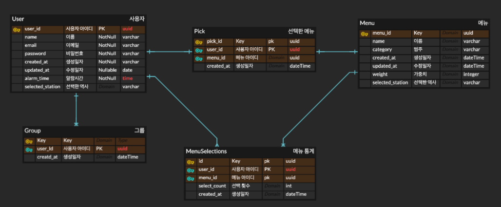

### 기능 리스트업

1. 회원가입(소셜 로그인 - 카카오)
    - 카카오 로그인 API 사용
    - 회원가입 시, DB에 저장
2. 알람 서비스
    - 앱 자체 캐싱 서비스(내부 DB)를 이용
3. 검색 API
    - 메뉴 리스트업
        - 검색 API로 주기적으로 데이터 수집
        - DB에 메뉴 저장 및 가중치 설정
        - 네이버 지역 검색 API를 활용([https://developers.naver.com/docs/serviceapi/search/local/local.md#지역](https://developers.naver.com/docs/serviceapi/search/local/local.md#%EC%A7%80%EC%97%AD))
        - 매 달마다 리프레쉬 필요
4. 사용자가 선택한 메뉴 가져오는 기능 (Pick 이라는 테이블을 만들고 선택한 시간과 그룹/솔로 인지 여부를 통해 그룹핑 가능)

---

### DB 구조

